- Overview:
  - [Kasper Template Look-Alike](#the-challenge)
  - [https://wella4life.github.io/Template_2/](#links)
  - 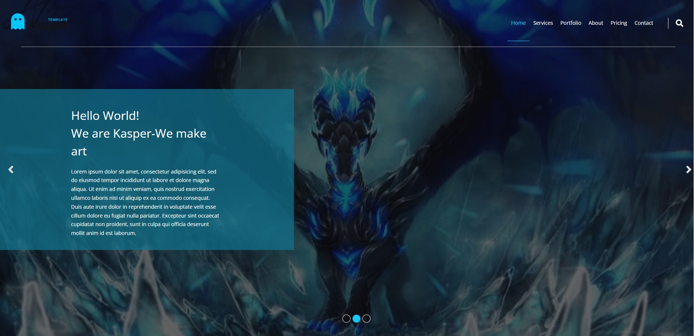
  - 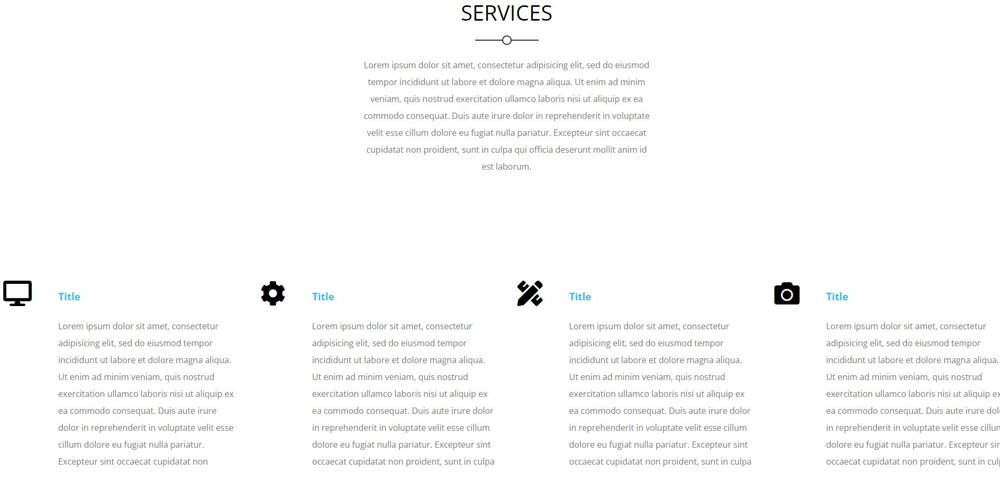
  - 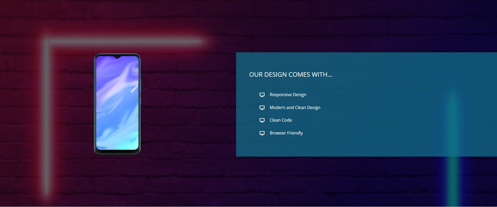
  - 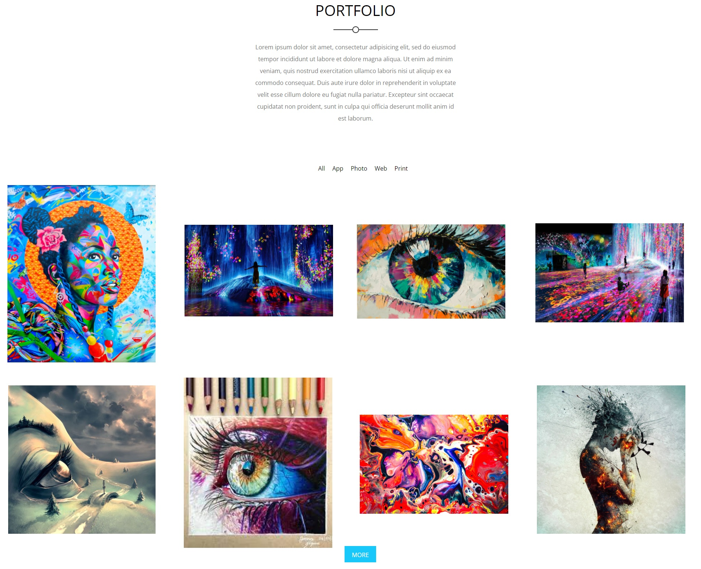
  - 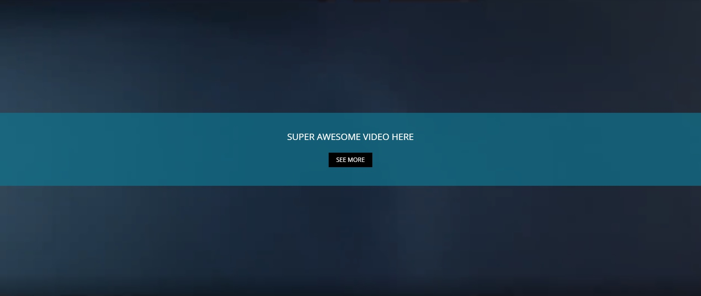
  - 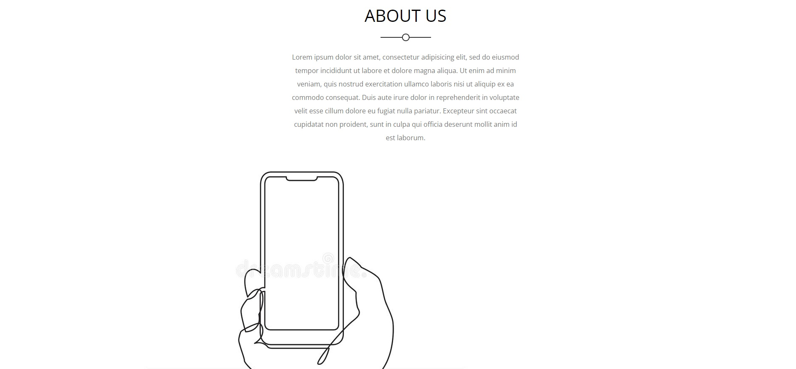
  - 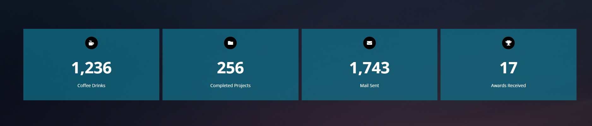
  - 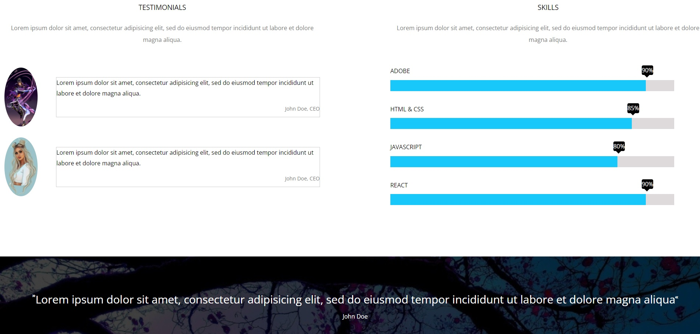
  - 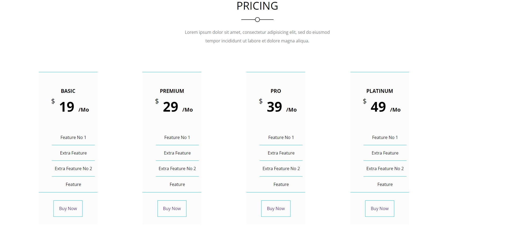
  - 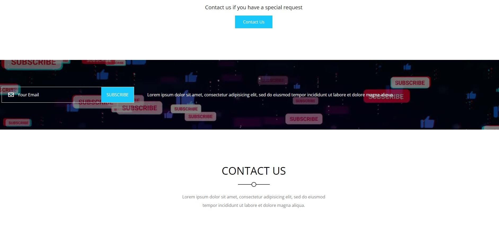
  - 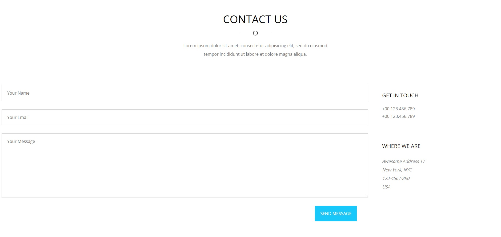
  - 

 - Users should be able to:
   - View the optimal layout for the site depending on their device's screen size
   - Hover Stats on many components
   - Active Stats on main components
   - Animations on many components

 - What I Learned:
   - Second ever project I was practicing on
   - Learned a lot of things that helped "too much to mention"
 
 - What I Couldn't Do:
   - Had many access issues
   - Hard time with Margins and spacing
   - Hard time with flex and grid
   - Mobile Version issues
